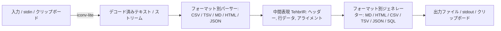

# tehbr

多機能テーブルフォーマット変換CLIツール / Multifunctional Table Format Conversion CLI Tool

[](https://nodejs.org/)
[](https://www.typescriptlang.org/)
[](LICENSE.MIT)

[日本語](#日本語) | [English](#english)

---

## 日本語

`tehbr` は、CSV、TSV、Markdown、HTML、JSON、SQL などのテーブルフォーマットを相互に変換するコマンドラインツールです。
ファイル変換のほか、大容量データのストリーミング処理、多言語文字コードの自動・手動変換、クリップボード連携、および対話型ウィザードモードを提供します。

### 仕組み (How it Works)
`tehbr` は入出力フォーマットを直接結合せず、**中間表現（`TehbrIR`）**を中心とした疎結合パイプライン構造で動作します。



1. **入力・デコード**: ファイル、標準入力、またはクリップボードから読み込んだバイナリデータを `iconv-lite` で UTF-8 へデコードします（Shift_JIS, GBK, Windows-1252 等に対応）。
2. **パース（解析）**: 入力フォーマットに応じたパーサーがデータを解析し、ヘッダー、2次元データ行、および列配置情報（左揃え/中央揃え/右揃え）を保持する `TehbrIR` オブジェクトを構成します。
3. **生成**: 指定された出力ジェネレーターが `TehbrIR` を受け取り、フォーマットに応じたテキスト（または SQL `CREATE TABLE` / `INSERT INTO` 文）を生成します。テキスト表示時の文字幅計算には `string-width` を使用し、全角文字が含まれる場合でも列揃えを維持します。
4. **ストリーミング (`--stream`)**: 大規模データ（CSV, TSV, JSON, SQL）の変換時、Node.js の Transform Stream を通してメモリ消費を抑えて順次処理します（※アライメント計算が必要な Markdown/HTML 出力時は、自動的にバッチモードへフォールバックします）。

### 主な機能
- **多形式の相互変換**: CSV、TSV、Markdown、HTML、JSON（NDJSON対応）、SQL（出力のみ）、および中間表現 JSON (`ir`) の変換に対応しています。
- **対話型ウィザードモード (`-i`, `--interactive`)**: プロンプトに従ってファイル指定、フォーマット選択、および列アライメント（左揃え・中央揃え・右揃え）を設定できます。
- **大容量ストリーミング処理 (`--stream`)**: メモリ消費を最小限に抑え、10万行を超えるテーブルデータも順次変換します。
- **多言語エンコーディング対応 (`-e`, `--encoding`)**: Shift_JIS, GBK, EUC-JP, Windows-1252, UTF-16 などの文字コードに対応しています。
- **クリップボード相互連携 (`-c`, `--clip`)**: クリップボードからの直接読み込み、および変換結果のクリップボード書き込み（標準出力/ファイル出力と併用可能）に対応しています。
- **多言語 UI インターフェース (`-l`, `--lang`)**: 日本語および英語のコマンドラインメッセージ表示に対応し、OS ロケールから自動検出します。

### インストール方法
```bash
# npm からグローバルインストール
npm install -g tehbr

# または GitHub から直接インストール
npm install -g DovahkiinYuzuko/tehbr
# （フルURL形式の場合）
npm install -g git+https://github.com/DovahkiinYuzuko/tehbr.git
```

### 使い方
#### 1. コマンドライン変換
```bash
# CSV を Markdown へ変換
tehbr input.csv -o output.md

# TSV を SQL (CREATE TABLE & INSERT INTO) へ変換
tehbr data.tsv -o data.sql -t sql -tbl my_table

# Shift_JIS の CSV を UTF-8 の Markdown へ変換
tehbr sjis_data.csv -o output.md -e Shift_JIS
```

#### 2. 対話型モード
```bash
tehbr -i
```

#### 3. クリップボード連携
```bash
# クリップボードのテキストを自動解析し、Markdown として標準出力およびクリップボードへ出力
tehbr -c -t markdown
```

### コマンドラインオプション
| オプション | 説明 |
| :--- | :--- |
| `[input]` | 入力ファイルのパス（省略時は標準入力またはクリップボードから読み込み） |
| `-o, --output <path>` | 出力ファイルの保存先パス（省略時は標準出力） |
| `-f, --input-format <format>` | 入力フォーマット (`csv`, `tsv`, `markdown`, `html`, `json`) |
| `-t, --output-format <format>` | 出力フォーマット (`markdown`, `html`, `csv`, `tsv`, `json`, `sql`, `ir`) |
| `-tbl, --table-name <name>` | SQL 出力時のテーブル名 |
| `-e, --encoding <name>` | 入力テキストの文字エンコーディング |
| `-c, --clip` | クリップボードの読み込み（入力省略時）および書き込みを有効化 |
| `--stream` | 省メモリ・高速ストリーミング処理モード（Markdown/HTML 指定時はバッチ処理へフォールバック） |
| `--no-header` | 1行目をデータ行として処理（デフォルトは1行目をヘッダーとして処理） |
| `-i, --interactive` | 対話型ウィザードモードの起動 |
| `-l, --lang <locale>` | UI 表示言語の指定 (`en`, `ja` 等。未指定時は OS ロケールを自動検出、デフォルト: `en`) |
| `--list-locales` | 利用可能な UI 表示言語の一覧を表示 |

### LICENSE
[MIT](./LICENSE.MIT)

Third-Party → [NOTICE.md](./NOTICE.md)

---

## English

`tehbr` is a command-line tool for converting table formats between CSV, TSV, Markdown, HTML, JSON, and SQL.
It provides file conversion, streaming processing for large datasets, multi-language encoding conversion, clipboard integration, and an interactive wizard mode.

### How it Works
`tehbr` operates using a decoupled pipeline centered on an **Intermediate Representation (`TehbrIR`)**.


1. **Input & Decoding**: Binary data read from files, stdin, or the clipboard is decoded to UTF-8 via `iconv-lite` (supports Shift_JIS, GBK, Windows-1252, etc.).
2. **Parsing**: Format-specific parsers extract headers, 2D data rows, and column alignment metadata (left, center, right) into a `TehbrIR` object.
3. **Generation**: Target generators take `TehbrIR` and render output strings or SQL statements. Text formatting uses `string-width` to maintain visual column alignment with East Asian full-width characters.
4. **Streaming (`--stream`)**: For large datasets (CSV, TSV, JSON, SQL), chunked Node.js Transform streams process data sequentially with low memory overhead (automatically falls back to batch mode for Markdown/HTML output requiring pre-calculated column padding).

### Features
- **Multi-Format Conversion**: Supports CSV, TSV, Markdown, HTML, JSON (including NDJSON), SQL (output only), and raw TehbrIR JSON (`ir`).
- **Interactive Wizard Mode (`-i`, `--interactive`)**: Provides a terminal prompt wizard for file selection, format choices, and column alignment configuration (left, center, right).
- **Big-Data Streaming (`--stream`)**: Processes tables exceeding 100,000 rows with minimal memory overhead.
- **Multi-Encoding Support (`-e`, `--encoding`)**: Handles multi-language encodings including Shift_JIS, GBK, EUC-JP, Windows-1252, and UTF-16.
- **Clipboard Integration (`-c`, `--clip`)**: Reads directly from clipboard when input is omitted, and writes converted results back to clipboard.
- **Multilingual UI (`-l`, `--lang`)**: Supports terminal interface messages in English and Japanese, auto-detected from OS locale.

### Installation
```bash
# Global installation from npm
npm install -g tehbr

# Or install directly from GitHub
npm install -g DovahkiinYuzuko/tehbr
# (Full Git+HTTPS URL syntax)
npm install -g git+https://github.com/DovahkiinYuzuko/tehbr.git
```

### Usage
#### 1. Command Line Conversion
```bash
# Convert CSV to Markdown
tehbr input.csv -o output.md

# Convert TSV to SQL (CREATE TABLE & INSERT INTO)
tehbr data.tsv -o data.sql -t sql -tbl my_table

# Convert Shift_JIS CSV to UTF-8 Markdown
tehbr sjis_data.csv -o output.md -e Shift_JIS
```

#### 2. Interactive Mode
```bash
tehbr -i
```

#### 3. Clipboard Integration
```bash
# Read table text from clipboard, convert to Markdown, and write to stdout & clipboard
tehbr -c -t markdown
```

### Command Line Options
| Option | Description |
| :--- | :--- |
| `[input]` | Input file path (defaults to reading from stdin or clipboard) |
| `-o, --output <path>` | Output file path (defaults to stdout) |
| `-f, --input-format <format>` | Input format (`csv`, `tsv`, `markdown`, `html`, `json`) |
| `-t, --output-format <format>` | Output format (`markdown`, `html`, `csv`, `tsv`, `json`, `sql`, `ir`) |
| `-tbl, --table-name <name>` | Table name for SQL generation |
| `-e, --encoding <name>` | Input text character encoding |
| `-c, --clip` | Enable reading from clipboard (when input omitted) and writing to clipboard |
| `--stream` | Enable low-memory streaming pipeline (falls back to batch mode for Markdown/HTML) |
| `--no-header` | Treat 1st row as data (defaults to treating 1st row as headers) |
| `-i, --interactive` | Launch interactive wizard mode |
| `-l, --lang <locale>` | Specify UI language (`en`, `ja`, etc. Auto-detects OS locale if omitted; default: `en`) |
| `--list-locales` | List all supported UI languages |

### LICENSE
[MIT](./LICENSE.MIT)

Third-Party → [NOTICE.md](./NOTICE.md)
